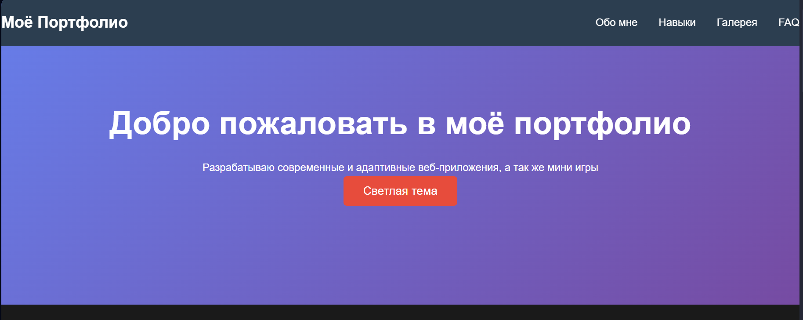
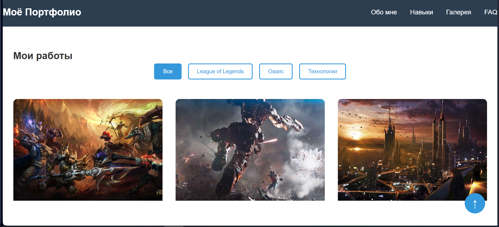

# Лабораторная работа №5: Введение в JavaScript

## Описание проекта
Добавление интерактивных элементов на страницу портфолио с помощью JavaScript.

## Функциональность
- ✅ Смена светлой/тёмной темы
- ✅ Кнопка "Наверх" с плавной прокруткой
- ✅ Аккордеон с вопросами и ответами
- ✅ Галерея с фильтрацией по категориям
- ✅ Модальное окно для просмотра изображений
- ✅ Плавная прокрутка по навигации
- ✅ Анимация появления элементов при скролле

## Структура проекта

```
lab5/
├── index.html
├── script.js
├── styles/style.css
├── images/
│   ├── League of Legends1.jpg
│   ├── League of Legends2.jpg
│   ├── Oazis1.jpg
│   ├── Oazis2.jpg
│   ├── tech1.jpg
│   └── tech2.jpg
└── README.md
```

## Использованные технологии
- HTML
- CSS
- JavaScript
- CSS Grid & Flexbox

## Запуск проекта
1. Склонируйте репозиторий
2. Откройте файл `index.html` в браузере
3. Для тестирования функций откройте консоль разработчика (F12)

## Ответы на вопросы

### 1. Какие интерактивности добавлены на страницу?

На страницу добавлены следующие интерактивные элементы:
- **Смена темы**: кнопка для переключения между светлой и тёмной темой.
- **Кнопка "Наверх"**: появляется при прокрутке вниз и плавно возвращает к началу страницы.
- **Аккордеон**: секция с вопросами, при клике на которые раскрывается ответ.
- **Галерея с фильтрацией**: изображения можно фильтровать по категориям (все, природа, город, технологии).
- **Модальное окно**: при клике на изображение в галерее оно открывается в увеличенном виде в модальном окне.
- **Плавная прокрутка**: при клике на ссылки в навигации страница плавно прокручивается до соответствующего раздела.
- **Анимация появления элементов**: элементы плавно появляются при прокрутке страницы.

### 2. Где использовался ИИ, а где код писался вручную?

- **ИИ использовался** для генерации базовой структуры кода для всех интерактивных элементов (кнопка "Наверх", аккордеон, фильтрация галереи, модальное окно). Также ИИ помог с написанием CSS для тёмной темы и анимаций.
- **Вручную писалась** адаптация кода под конкретную структуру HTML, интеграция всех скриптов в один файл, отладка и тестирование функциональности. Также вручную были написаны обработчики событий для плавной прокрутки и анимации появления.

### 3. Что показалось самым интересным или сложным?

- **Интересным** было наблюдать, как с помощью нескольких строк JavaScript можно значительно улучшить пользовательский опыт: плавные переходы, интерактивные элементы, динамическое изменение темы.
- **Сложным** оказалась отладка работы аккордеона, чтобы при открытии одного элемента закрывались другие, а также корректная работа фильтрации галереи и модального окна вместе.

### 4. Какие запросы делали LLM?

1. "Напиши JavaScript, который добавляет кнопку 'Наверх'. При прокрутке страницы вниз она появляется, при нажатии – плавно прокручивает вверх."
2. "Сделай аккордеон на чистом JS: несколько заголовков, при клике открывается и закрывается блок текста."
3. "Создай фотогалерею с фильтрацией по категориям. При выборе категории показывай только соответствующие фото."
4. "Добавь обработчик: при клике на фото открывается модальное окно с увеличенным изображением и затемнением фона."
5. "Как сделать плавную прокрутку к якорям на чистом JavaScript?"
6. "Как добавить анимацию появления элементов при скролле на vanilla JavaScript?"


## Скриншоты:



